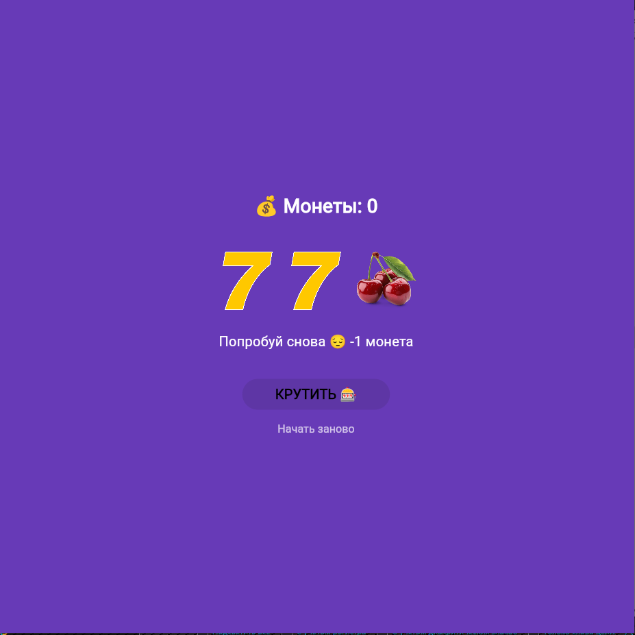

# Лабораторная работа №6. Flutter: StatefulWidget и управление состоянием

**Выполнил:** Дунюшкин Н.С | Салалыкина О.М

**Группа:** ИСП-233

**Дата:** 28.04.2026  

### Что я изучил в этой работе:
* Понял, чем отличаются Stateless и Stateful виджеты.
* Научился обновлять экран приложения с помощью функции setState.
* Узнал, как разбивать код на несколько файлов и соединять их через import.
* Потренировался делать красивые градиентные фоны и стилизовать текст.
* Разобрался, как работать с Git и делать коммиты по ходу разработки.

### Скриншот приложения
 


### Как запустить проект
1. Установите Flutter на компьютер.
2. Склонируйте репозиторий или скачайте архив с кодом.
3. Откройте папку проекта в терминале.
4. Введите команду для запуска в браузере:
   ```bash
   flutter run -d chrome